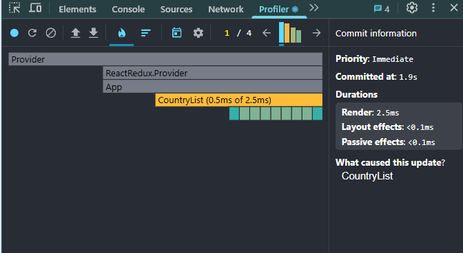
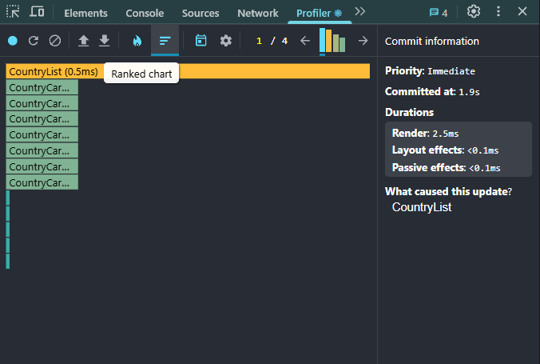
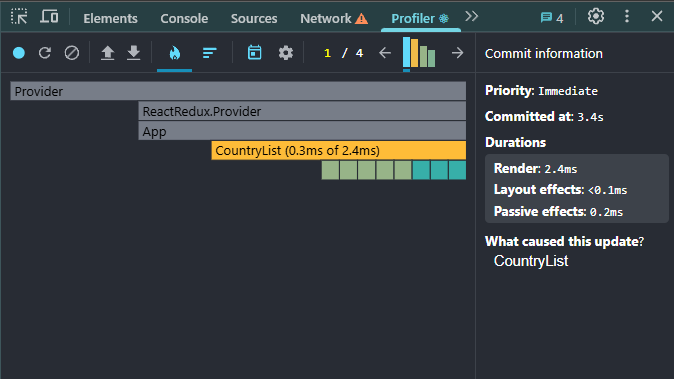
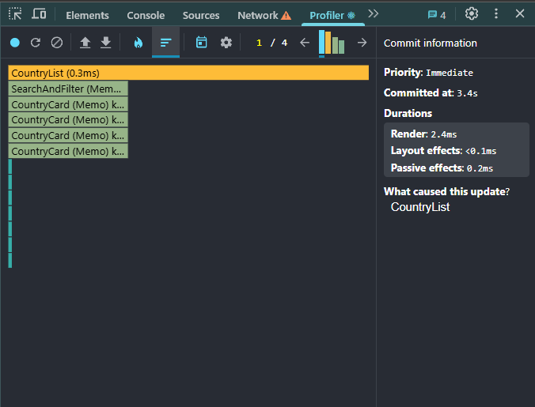

# React Countries App — Performance Profiling

This project fetches country data from the REST Countries API and displays it with filtering, sorting, and visited countries tracking. This README documents performance profiling results **before and after optimization**.

---

## 🔎 Initial Profiling — Before Optimization

**Action**:

- Filter: Region "Europe"
- Search: "fr"
- Sort: Population (asc)

**Results:**

- Commit Duration: **2.5ms**
- CountryList render time: **0.5ms**
- CountryCard renders: ~10 components, total ~1ms
- Interaction Triggered: `CountryList`

**Screenshots**:

- 
- 

---

## 🚀 After Optimization

**Optimizations applied**:

- `React.memo` on CountryCard, SearchAndFilter, Pagination.
- `useMemo` for filtering, sorting, pagination logic.
- `useCallback` for event handlers.

**Action**: Same as above.

**Results:**

- Commit Duration: **2.4ms**
- CountryList render time: **0.3ms**
- CountryCard (Memo) renders: only relevant cards rendered, each <0.1ms
- Interaction Triggered: `CountryList`

**Screenshots**:

- 
- 

---

## 🔄 Comparison Table

| Metric                    | Before         | After           |
| ------------------------- | -------------- | --------------- |
| Commit Duration           | 2.5ms          | 2.4ms           |
| CountryList render time   | 0.5ms          | 0.3ms           |
| CountryCard total renders | ~10 components | only few (Memo) |
| Triggered By              | CountryList    | CountryList     |

---

## ✅ Conclusion

After applying `React.memo`, `useMemo`, and `useCallback`, the application reduced unnecessary renders, especially for `CountryCard`, improving efficiency with larger datasets and faster UI interactions.
